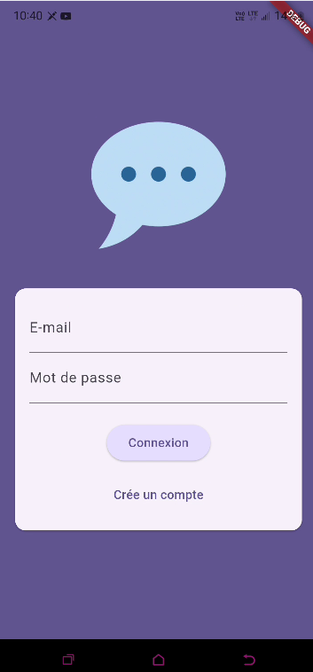
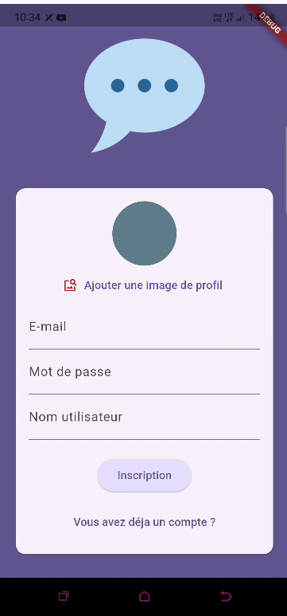
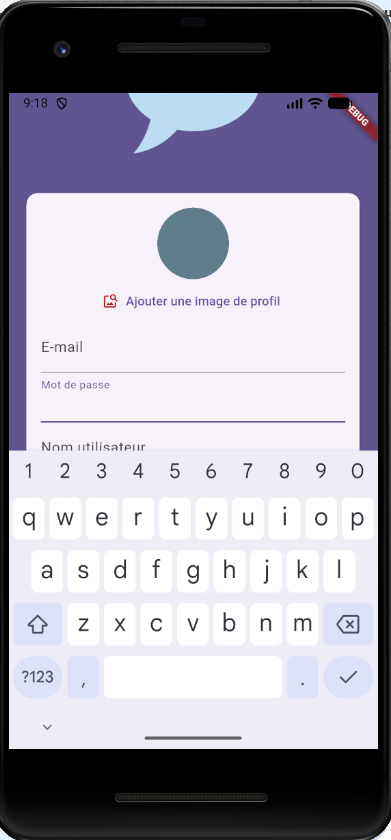
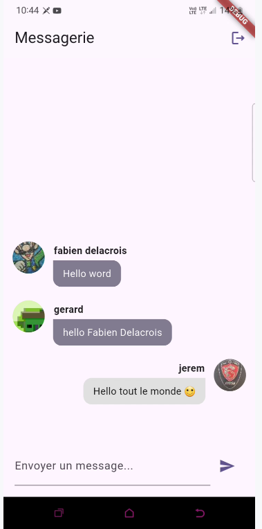
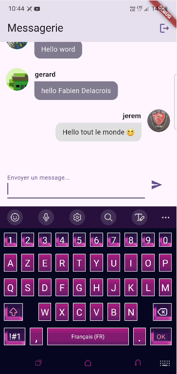

# 📚 Flutter Chat App

**Flutter Chat App** est une application mobile de messagerie instantanée développée avec **Flutter** et **Firebase**.  
Elle permet aux utilisateurs de s’inscrire, se connecter, envoyer des messages en temps réel et partager des images.  
Le projet met l’accent sur l’apprentissage de Firebase, l’authentification, le Cloud Messaging et la gestion d’une interface de chat moderne.

---

## 🎯 Objectifs du projet

- Comprendre l’intégration de Firebase dans une application Flutter
- Mettre en place l’authentification (email / mot de passe)
- Envoyer et recevoir des messages en temps réel
- Apprendre à stocker des images avec Firebase Storage
- Gérer la base de données en temps réel (Firestore)
- Implémenter les notifications push (FCM)
- Construire une UI de chat fluide et moderne

---

## 🧩 Fonctionnalités

- Inscription et connexion utilisateur  
- Envoi de messages texte  
- Envoi d’images via la galerie ou la caméra  
- Affichage dynamique des messages en temps réel  
- Gestion automatique du scroll  
- Authentification sécurisée via Firebase Auth  
- Stockage des images dans Firebase Storage  
- Gestion des notifications push (Firebase Cloud Messaging)

---

## 🛠️ Technologies utilisées

- **Flutter**
- **Dart**
- **Firebase Authentication**
- **Cloud Firestore**
- **Firebase Storage**
- **Firebase Cloud Messaging (FCM)**
- Widgets **Material**
- Gestion d’état via `setState` + Streams Firestore

---

### Écran d’authentification -> connexion


### Écran d’authentification -> inscription


### Clavier


### Messagerie


### Messagerie-> clavier



---

## 🧱 Architecture simple du projet

```text
lib/
 ├─ main.dart                        # Point d'entrée de l'application
 ├─ screens/
 │    ├─ auth_screen.dart            # Écran d'inscription / connexion
 │    ├─ chat_screen.dart            # Interface principale de chat
 │    └─ splash_screen.dart          # Chargement / redirection
 ├─ widgets/
 │    ├─ send_message.dart           # Champ texte + bouton d’envoi
 │    ├─ chat_list_message.dart      # Affichage des messages
 │    ├─ message_bubble.dart         # Widget d’un message
 │    └─ image_picker.dart           # Sélection d’image
 ├─ services/
 │    └─ firebase_service.dart       # (optionnel) gestion centralisée Firebase
 └─ utils/                           # (optionnel) helpers
